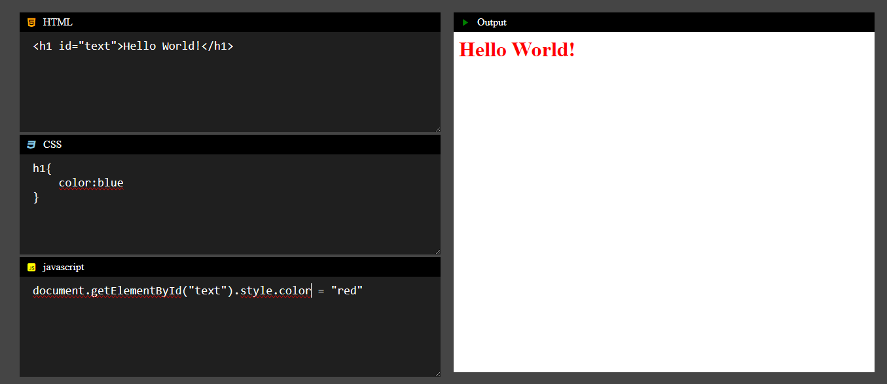

# 💻 Simple Code Editor (HTML, CSS, JS)

A lightweight, in-browser **code editor** that lets users write and instantly preview **HTML**, **CSS**, and **JavaScript** code in real-time. Built entirely with vanilla **HTML**, **CSS**, and **JS** — no frameworks, no external dependencies.

---

## 🌐 Live Demo

🔗 [Try It Live]( https://mubeen2005.github.io/CodeEasy/)  

---

## 🖼️ Preview

  

---

## 🧰 Tech Stack

- 🧱 **HTML** – Editor layout and structure
- 🎨 **CSS** – Responsive and styled UI
- ⚙️ **JavaScript** – Dynamic code execution using `iframe`

---

## ✨ Features

- 🔤 Write code in three separate panels: **HTML**, **CSS**, and **JavaScript**
- ⚡ Instant live preview as you type
- 🪞 Output displayed in a real-time rendered iframe
- 💾 Clear or reset code easily
- 📱 Responsive layout — works on all screen sizes
- 🧼 Minimal and distraction-free UI

